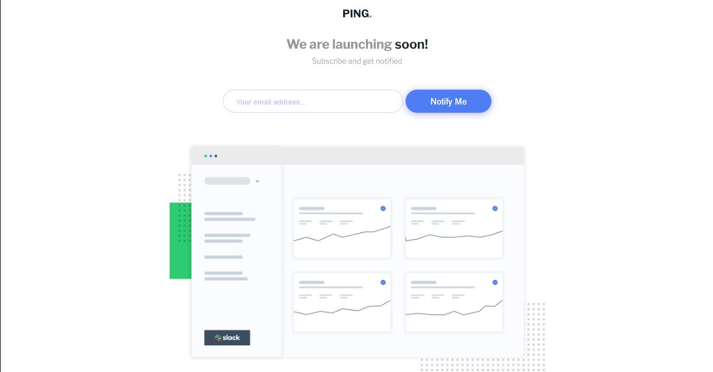

# Frontend Mentor - Ping coming soon page solution

This is a solution to the [Ping coming soon page challenge on Frontend Mentor](https://www.frontendmentor.io/challenges/ping-single-column-coming-soon-page-5cadd051fec04111f7b848da). Frontend Mentor challenges help you improve your coding skills by building realistic projects. 

### Screenshot




## The challenge

Users should be able to:

- View the optimal layout for the site depending on their device's screen size
- See hover states for all interactive elements on the page
- Submit their email address using an `input` field
- Receive an error message when the `form` is submitted if:
	- The `input` field is empty. The message for this error should say *"Whoops! It looks like you forgot to add your email"*
	- The email address is not formatted correctly (i.e. a correct email address should have this structure: `name@host.tld`). The message for this error should say *"Please provide a valid email address"*


### Links

- [GitHub](https://github.com/ikennarichard/ping-coming-soon-page)
- [Live link](https://your-live-site-url.com)

## My process

### Built with

- Semantic HTML5 markup
- CSS custom properties
- Flexbox
- CSS Grid
- Mobile-first workflow

### What I learned

Well, i had the chance to practice the css filter, its easy to use it to apply styles to icons rather than having tp style a parent container.  I learnt some new ways to use css selectors to style specific, ceck out the example below.

```css
 .icons span:hover .icons_ {
    filter: brightness(0) invert(1);
    cursor: pointer;
    
 }
```


### Continued development

This project helped to understand the importance of regex, ive intentionally avoided it, havent really take it serious. Regex is extrememly powerful and help minimze a lot of stress.  

### Useful resources

- [Test Regex](https://regexr.com) - I used this platform to test my regex, is a good learning tool.

## Author

- Website - [ikennarichard](https://github.com/ikennarichard)
- Frontend Mentor - [@yourusername](https://www.frontendmentor.io/profile/ikennarichard)

## Acknowledgments

Thanks Adriano, your a good man, thanks to all my mentors for their support. YOU GUYS ARE AWESOME!
